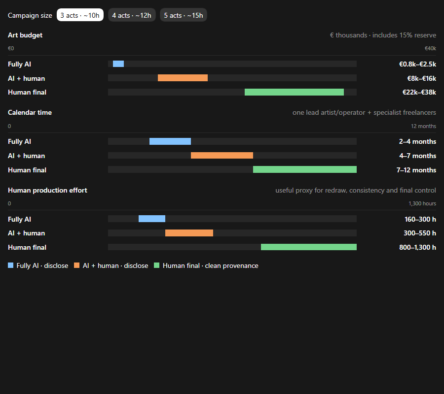

# Grimtoll: AI art, Steam disclosure, budget and production options

**Prepared:** 1 August 2026  
**Purpose:** A practical decision memo for a 10–15 hour Grimtoll campaign with three starting characters and three to five acts.

**Revised for a lean first-indie production:** The original version priced a near-studio outsourcing model with too many unique illustrations. This version assumes the developer keeps creative direction and integration, reuses locations, keeps combat art modular, and commissions humans selectively.

## Short conclusion

For a first commercial game, the best balance is **AI + human production**, with a human artist controlling the visual direction and personally creating the assets that sell the game.

For a first release, the strongest scope is **three acts and approximately 10 hours**, with three distinct openings that converge into a mostly shared campaign. The working target is:

- **Budget:** **€8,000–€16,000 for art**
- **Recommended target:** approximately **€12,000**, with an **€18,000 ceiling**
- **Schedule:** 4–7 calendar months alongside development
- **Steam:** disclose pre-generated AI assistance
- **Human-created from scratch:** capsule, key art, logo, three starting heroes, 8–12 important story scenes, modular combat designs and final UI
- **AI + human:** secondary event illustrations, variations and volume content

This gives a much stronger result than unedited AI while avoiding the cost and long schedule of rebuilding every final asset completely by hand.

## The production graph

Open the interactive comparison:

- `AI_ART_PRODUCTION_GRAPH.html`

Static preview:

The graph uses **human production hours as a proxy for redraw, consistency and final control**. “Quality” itself cannot be measured honestly with one number.

## Scope used for the estimate

The lean three-act version assumes approximately:

- 30–45 full event or location illustrations, with reusable location plates
- 18–25 portraits
- 20–30 tactical bases or variants built from modular race, weapon and armour sets
- 6–10 environments and major screen backgrounds
- 60–100 smaller UI, equipment, status, node and effect assets
- One professional key-art, logo and Steam-capsule package
- Limited animation: idle motion, interface movement and combat effects, but no cinematic animation

The estimate assumes the three starting characters have different openings and a few recurring exclusive scenes, while **75–85% of the campaign is shared**. The existing Act 1 AI artwork and style experiments are treated as useful prototype material rather than starting from zero.

If each starting character instead has a substantially separate 10–15 hour campaign, multiply the narrative-art portion by approximately **2.0–2.5**. Even a lean hybrid version would then move toward roughly **€25,000–€45,000**.

## Budget and calendar comparison

These are art-only estimates. They exclude programming, writing, music, voice acting, trailers and general marketing. They include approximately 15% for revisions and failed batches but exclude VAT.

| Pipeline | 3 acts / ~10h | 4 acts / ~12h | 5 acts / ~15h |
|---|---:|---:|---:|
| Fully AI final art, developer-operated | €0.8k–€2.5k · 2–4 months | €1.2k–€3.5k · 3–5 months | €1.8k–€5k · 4–7 months |
| AI + selective human production | **€8k–€16k · 4–7 months** | €11k–€22k · 6–9 months | €15k–€30k · 8–12 months |
| AI prototype → entirely human final | €22k–€38k · 7–12 months | €30k–€52k · 9–15 months | €40k–€70k · 12–20 months |

Public 2026 outsourcing guides place professional 2D production broadly around $25–$80 per hour, while Upwork’s global historical contract figures start lower. The lean estimate does **not** assume a full-service art studio. It assumes direct contracts with one reliable freelance generalist plus occasional specialists, narrow revision limits, clear briefs and developer-managed integration.

Sources:

- https://pixune.com/blog/game-art-outsourcing-price/
- https://www.upwork.com/hire/illustrators/cost/
- https://www.juegostudio.com/game-art-services

## Option 1: fully AI final art

### What it means

AI creates almost all final illustrations, portraits, backgrounds and unit concepts. A person selects images, repairs obvious defects, makes crops and integrates the files.

### Three-act lean estimate

- €800–€2,500 in direct cash cost when the developer operates the tools
- Approximately 160–300 hours of generation, selection, cleanup and integration
- 2–4 calendar months alongside development
- Hiring someone else to operate and integrate the entire AI pipeline would raise this substantially and defeats much of its cost advantage

### Advantages

- Lowest cash requirement
- Fastest way to fill a large story
- Cheap to discard assets while the design changes

### Main risks

- Character identity and style consistency
- Hands, equipment, anatomy, architecture and visual continuity
- Tactical units and transparent overlays still require manual work
- Highest “AI slop” perception risk
- Steam AI disclosure required
- Harder publisher, merchandise and copyright conversations

This approach is appropriate for prototypes and internal playtests. It is a risky choice for the final public presentation of a story-heavy game.

## Option 2: AI + human final art — recommended

### What it means

AI produces composition drafts or bases. A professional artist redraws faces, anatomy, silhouettes, lighting, materials and important details, then prepares game-ready files.

The AI-created basis remains part of the shipped asset, so this is still AI-assisted for Steam disclosure.

### Three-act lean allocation

| Area | Working budget |
|---|---:|
| Style lock, key art and Steam capsule | €1.5k–€3k |
| 8–12 human-made pivotal scenes | €1.5k–€3k |
| 20–30 hybrid secondary scenes and locations | €1.5k–€3.5k |
| Portrait library | €0.8k–€1.5k |
| Tactical modular sets, UI and icons | €1.5k–€3k |
| Integration, revisions and reserve | €1.2k–€2k |
| **Total** | **€8k–€16k** |

### Recommended division

Create these entirely by humans:

- Steam capsule and main key art
- Logo and core interface language
- Three starting-character portraits
- Approximately 8–12 pivotal story illustrations
- Modular battlefield character, weapon and armour designs

Use AI plus human finishing for:

- Secondary road events
- Background locations and weather variations
- Less important NPC and recruit portraits
- Composition exploration and alternate versions

This concentrates the strongest human work where players make purchase decisions and form emotional attachments.

## Option 3: AI prototypes, entirely human final assets

### What it means

AI material is temporary and does not ship. Human artists construct the final paintings, portraits, units and UI themselves.

For the cleanest provenance, artists should receive:

- The written game and scene brief
- The playable build
- The human-approved style bible
- Licensed or public-domain references
- Human sketches and layout requirements

They should not simply paint over or trace an AI-generated image. If an AI image directly supplies the final composition or design, conservatively treat the result as AI-assisted.

### Three-act lean estimate

- €22,000–€38,000
- Approximately 800–1,300 human art hours
- 7–12 calendar months with one lead and occasional specialists

This provides the strongest authorship story and the lowest AI-reputation risk, but it still costs roughly two to three times as much as the lean hybrid route.

## Steam disclosure: does partial AI get the same flag?

Yes. Steam has one public **AI-generated content disclosure section**. The written explanation can distinguish a few assisted assets from an almost entirely generated game, but the page still receives the disclosure section.

Valve’s current wording covers player-facing artwork, sound, narrative, localization and other shipped content created **with the help of AI tools**. Human editing or paintover does not automatically remove the requirement.

Official policy:

- https://partner.steamgames.com/doc/gettingstarted/contentsurvey?language=english

### Practical classification

| Workflow | Disclose? | Reason |
|---|---|---|
| Raw AI image ships | Yes | AI-created player-facing content |
| AI image receives corrections or paintover and ships | Yes | The shipped asset was still created with AI help |
| AI composition is closely traced or recreated | Treat as yes | AI materially supplied the design/composition |
| AI used only for discarded internal experiments; human final independently produced from the brief | Strongest case for no shipped-AI disclosure | No generated asset is consumed by the player |
| AI coding assistant, scheduling or other efficiency tool that does not create player-facing content | Generally not the focus of this survey | Valve focuses the section on shipped player-consumed content |

This is practical risk guidance, not a legal opinion. If a borderline workflow matters commercially, describe it to Steam Support before release and retain their answer.

## How Steam checks

Steam has not publicly announced a universal, reliable AI-image detector.

Its published process is primarily:

1. Developer self-disclosure through the Content Survey.
2. Human review of the store page and submitted build.
3. Comparison of survey answers with content in the build and marketing.
4. Reports, copyright claims and public scrutiny after release.
5. Steam Support corrections when content or survey answers change.

Official review documentation:

- https://partner.steamgames.com/doc/store/review_process

A heavily painted-over image may be difficult to identify from pixels alone. That does not change the disclosure obligation.

## What happens if the developer answers “No” and Steam finds “Yes”?

Valve does not publish a fixed public penalty table for false AI answers.

Possible outcomes include:

- Before release: failed review, correction request, asset replacement and launch delay
- After release: required survey correction and possibly asset replacement
- For serious, repeated or infringing content: potential delisting or action under the signed Steam Distribution Agreement
- Publicly: negative reviews and a lasting trust problem

The risk is asymmetric. Disclosed AI is permitted. If hidden AI is discovered, the disclosure may be added anyway, but the public story becomes that the developer tried to conceal it.

Suggested truthful hybrid disclosure:

> Pre-generated generative AI tools were used during the creation of selected 2D event illustrations and character artwork. These assets were reviewed, corrected and edited by human artists. The game does not use live-generated AI.

If “No” has already been submitted, contact Steam Support before release and request a correction.

## Does AI disclosure hurt sales?

There is a real audience stigma, but no trustworthy universal conversion penalty for an individual game.

One 2026 analysis of 9,879 Steam games released during January–October 2025 reported approximately 53% fewer first-month reviews for AI-disclosed titles after statistical controls. Reviews are only a sales proxy, and observational controls cannot fully separate the disclosure from lower budgets, weaker games, inexperienced developers or different marketing. Treat the result as a warning—not a forecast that Grimtoll will lose exactly half its sales.

- https://www.pcgamer.com/software/ai/data-analyst-finds-ai-stigma-on-steam-can-reduce-the-number-of-reviews-a-game-gets-by-around-53-percent-and-the-reviews-it-does-get-are-more-negative/

Another public analysis reported 7,818 Steam games with disclosures and approximately one in five 2025 releases using disclosed generative AI. Public disclosure data necessarily misses undeclared use.

- https://www.tomshardware.com/video-games/pc-gaming/1-in-5-steam-games-released-in-2025-use-generative-ai-up-nearly-700-percent-year-on-year-7-818-titles-disclose-genai-asset-usage-7-percent-of-entire-steam-library

The commercial lesson is not “AI games cannot sell.” It is that visible quality, honesty and a strong capsule matter more when a disclosure is present.

## Comparable games checked

On 1 August 2026, no public AI-generated-content disclosure was visible in the Steam page text checked for these five close reference games:

- Battle Brothers — https://store.steampowered.com/app/365360/Battle_Brothers/
- Wartales — https://store.steampowered.com/app/1527950/Wartales/
- Wildermyth — https://store.steampowered.com/app/763890/Wildermyth/
- Darkest Dungeon — https://store.steampowered.com/app/262060/Darkest_Dungeon/
- Slay the Spire — https://store.steampowered.com/app/646570/Slay_the_Spire/

That is **0 of 5 in this small reference set**, not proof about the entire tactical-RPG market. Most of these games also predate Steam’s AI-disclosure system.

## Palworld

Palworld is not good evidence that AI art causes—or does not hurt—success.

- There has been no conclusive public evidence that Palworld’s shipped creatures or art were generated with AI.
- Pocketpair CEO Takuro Mizobe publicly denied using generative AI for Palworld and said its artists produced thousands of sketches.
- Pocketpair’s publishing leadership later said it would not partner with generative-AI games.
- Palworld was unquestionably huge: Pocketpair reported more than 32 million players by February 2025.

Sources:

- https://www.gamesradar.com/games/survival/palworld-dev-finds-common-ground-with-nintendo-dismisses-use-of-generative-ai-our-artists-draw-thousands-of-sketches/
- https://www.gamespot.com/articles/palworld-devs-publishing-arm-wont-work-with-genai-games/1100-6535619/
- https://www.pocketpair.jp/en/news/palworld-blasts-past-32-million-players/

The correct conclusion is: **Palworld became enormous, but it is not a verified example of a successful AI-art game.**

## Recommended production decision

Use the hybrid route, but make it a **human-led pipeline**, not an AI pipeline with an artist cleaning mistakes.

### Target plan for the three-act first release

1. **Style lock + one human key image:** 3–4 weeks, €1.5k–€2.5k
2. **Steam page and Act 1 polish:** 6–8 weeks, €2k–€3.5k
3. **Acts 2–3 volume production:** 2–4 months, €3k–€6k
4. **Final UI, consistency and export pass:** 4–6 weeks, €1k–€2k
5. **Contingency:** keep €1.5k–€2.5k uncommitted and release it only after the demo proves the art direction

### Approval gates

Do not commission the full game immediately. Approve production in this order:

1. One human key image
2. One hybrid event image
3. One portrait family containing all three races
4. One complete tactical character with equipment variations
5. One UI screen implemented in the game
6. Only then commission the first 15–20 asset batch

### If the art ceiling is below €8,000

- Keep procedural battlefield tokens for the first release
- Reduce unique full event illustrations to 20–30
- Reuse location plates with different characters, weather and crops
- Use human money on the capsule, three protagonists and approximately six pivotal scenes
- Avoid character animation beyond restrained idle motion

This reduced hybrid production can target roughly **€5k–€8k and 4–6 months**, but it needs disciplined reuse, developer-managed cleanup and a smaller illustration list.

## Final recommendation in one sentence

For Grimtoll’s first release, plan around **€12,000 with an €18,000 ceiling**, build three acts rather than five, let the three origins converge early, use AI plus selective human production for volume, make the selling and emotional assets fully human, and disclose the AI assistance honestly.
